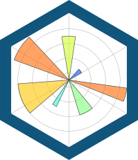

# CIFAR-10 Image Classification
CIFAR-10 Image Classification in TensorFlow
It is a classification based CNN(Convolutional Neural Network) model to classify the images of CIFAR-10 dataset.
### Tools and Languages Used:



<br>

## Introduction to the dataset
The CIFAR-10 dataset consists of 60000 32×32 colour images in 10 classes, with 6000 images per class. There are 50000 training images and 10000 test images. They are mutually exclusive.and there are no overlap between them. Where as all images are colored.

## Steps to follow
-Download the code from the given github repository<br>
-open it in colab platform <br>
-Run the code<br>

# Breaking the code

==>Importing Tenserflow

->Code snippet 1
```python
import tensorflow as tf
```

==>Importing the dataset <br>
->Code snippet 2
```python
from tensorflow.keras import datasets, layers, models
import matplotlib.pyplot as plt
```

==>Downloading and preparing the CIFAR10 dataset <br>
->Code snippet 3
```python
# tuple of tuples 
(train_images, train_labels), (test_images, test_labels) = datasets.cifar10.load_data() # these data assigned to these variables
# train_images - will have all images in training data
# train_labels - will have labels for all all those respective images in training data
# test_images - will have all images in training data
# test_images - will have all images in training data

#normalising pixel values to be between 0 and 1
train_images, test_images = train_images/255.0, test_images / 255.0 # it will convert the pixel data hat was in
```

==>Verifying the data <br>
->Code snippet 4
```python
class_names = ['airplane', 'automobile', 'bird', 'cat', 'deer', 'dog', 'frog', 'horse', 'ship', 'truck']
plt.figure(figsize=(10,10))
for i in range(25):
  plt.subplot(5,5,i+1)
  plt.xticks([])
  plt.yticks([])
  plt.grid(False)
  plt.imshow(train_images[i], cmap=plt.cm.binary)
  # the CIFAR labels happen to be arrays, so we need extra index
  plt.xlabel(class_names[train_labels[i][0]])
plt.show()
```
* To verify the dataset, let's plot first 25 images from training set and display class name below each image.<br>
<p float="left">
  
</p>
<br>

==>Createing convolutional base
->Code snippet 5
```python
model = models.Sequential() # Sequential fxn means the data will flow sequentially (feed forward neural network)
# layer creates a particular layer of Convoluttional2D
model.add(layers.Conv2D(32, (3, 3), activation = 'relu', input_shape=(32, 32, 3))) #it is the input layer(1st convolutional layer), 32 is the no of filters(each filter produce different convolutional maps), size of each filter will be 3*3, here we are using relu as activation fxn, as it is an input layer it takes input from images and images will be fed in the shape of(32, 32, 3) where 32,32 is height and width pixels and 3 denotes no of channels(R,G,B)
model.add(layers.MaxPooling2D((2, 2))) # It is max pooling, it takes a particular matrix and takex maximum of them
model.add(layers.Conv2D(64, (3, 3), activation='relu')) # 2nd convolutionallayer over max pooling, with relu as activation function
model.add(layers.MaxPooling2D((2, 2)))
model.add(layers.Conv2D(64, (3, 3), activation='relu')) # 3rd convolutionallayer over max pooling, with relu as activation function
```
* As input CNN takes tensors of (image_height, image_width, color_channels). Color channels refers to (R,G,B). Here we are using relu activation function to avoid -ve values.<br>


==>Let's display the summary<br>
->Code snippet 6
```python
model.summary()
```
* Here we have 56,320 weights for this convolutional layer.
The output of every Conv2D and maxPooling2D layer is a 3D tensor of shape(height, widht, channels). The height and width dimensions tend to shrink as we go deeper in the network.
Creating a dense layer(all neuron of previous layer be connected to all the neurons of current layer) after flattened layer.


==>flattening the output from last convolutional layer and adding a dense layer
->Code snippet 7
```python
model.add(layers.Flatten()) # flattening the output from last convolutional layer
model.add(layers.Dense(64, activation='relu')) #last hidden layer, here we are adding a dense layer 
model.add(layers.Dense(10))
```


==>let's see the complete architecture of the model.
->Code snippet 8
```python
model.summary()
```


*Compile and train the model.
->Code snippet 9
```python
model.compile(optimizer='adam',loss=tf.keras.losses.SparseCategoricalCrossentropy(from_logits=True),metrics=['accuracy'])
history = model.fit(train_images, train_labels, epochs=10, validation_data=(test_images, test_labels)) # training the model, validation data- test data
```
*Accuracy is getting better eventually.<br>

==>Evaluating the model
->Code snippet 10
```python
test_loss, test_acc = model.evaluate(test_images, test_labels, verbose=2)
print(test_acc)
```
Our CNN has achieved a test accuracy of over 70.8%.<br>

# Developed by:
<a href="https://github.com/sambit221">Sambit Kumar Tripathy</a>
