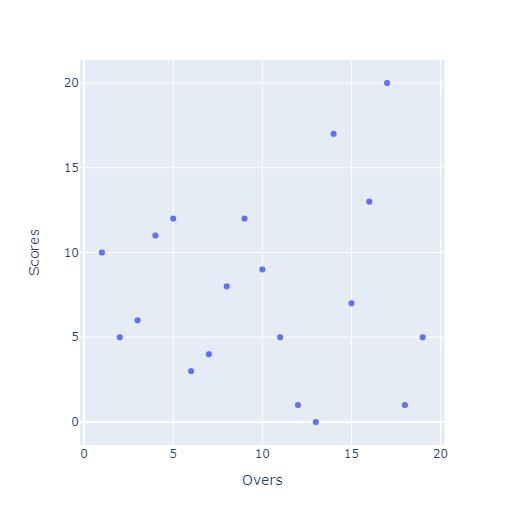

# cricket-score-prediction
It is a linear regression base Machine Learning model, that can predict cricket score prediction in an upcoming over. 
Its my first project using some custom dataset and manipulating it to get the required prediction for upcoming over.

## About the dataset
Dataset used- Sample scores.csv (uploaded above along with the project)
* it has a total of 19 instances 
* 2 columns overs, scores

### Tools and Languages:


<br>

### Steps to follow
-Install the given libraries<br>
-Download the code from the given github repository<br>
-Run the code<br>

### Installing Libraries

```cmd
pip install numpy
pip install pandas
pip install sklearn
```

### Breaking the code

-Code snippet 1<br>
* Step1: Importing the Libraries
```python
import pandas as pd
import numpy as np
```
* Numpy is for performing numerical calculations. Pandas is for reading CSV files.

-Code snippet 2<br>
* Step 2: Reading the CSV files
```python
data = pd.read_csv('Sample scores.csv')
```


-Code snippet 3<br>
* Step 3: Importing Linear regression using SKLEARN 
```python
from sklearn.linear_model import LinearRegression
```

-Code snippet 4<br>
* Step 4: Data-Visualization<br>
* Its optional its just to show the data graphically
```python
import plotly.express as px
fig = px.scatter(data,x='Overs', y='Scores')
fig.show()
```
Here we have Plotted a graph showing the data-points. Overs in x-axis and Scores in y axis.

### Plotted graph:


-Code snippet 5<br>
* Step 5: Creating dataframes aligning them in a single column
```python
linear_reg = LinearRegression()
x = data.Overs.values.reshape(-1,1)
y = data.Scores.values.reshape(-1,1)
```

-Code snippet 6<br>
* Step 6: Applying formula on dataframes (training the data)
```python
linear_reg.fit(x,y)
```

-Code snippet 7<br>
* Step 7: Prediction of 20th over
```python
final_prediction = linear_reg.predict([[19]])
print(int(final_prediction))
```

Output: 8 runs will be 20th over score for this given dataset. 

### Developed by:
<a href="https://github.com/sambit221">Sambit Kumar Tripathy</a>
